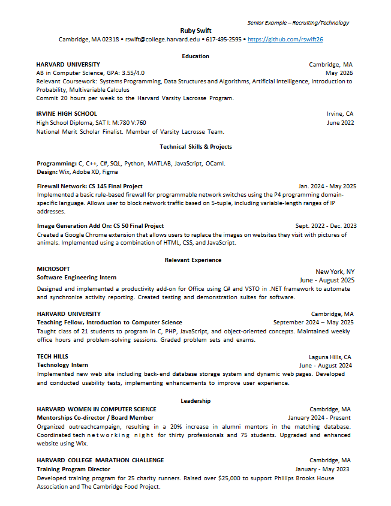
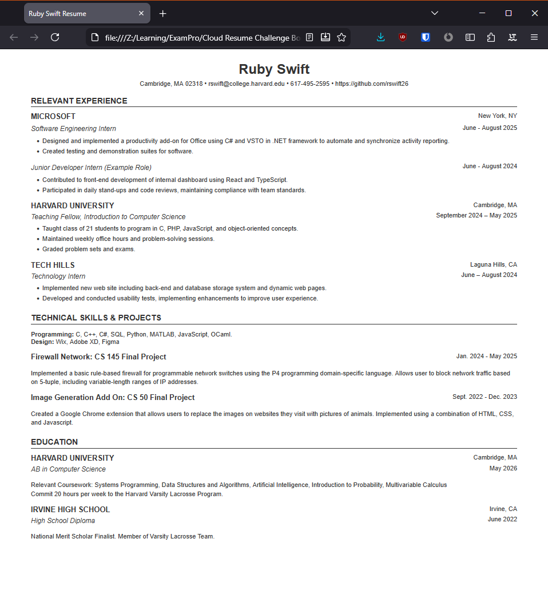

# Frontend Technical Specification

- Create a static website that servces an HTML résumé.

## Résumé Format Considerations

Canadian résumé expectations (whether printer or in digital format such as DOCX or PDF) are that they should exclude personal, non-business related information. For example, age, ethnicity, gender, relationships. Résumés typically don't include GPA grades unless specific jobs or job fields expect such information.

In Canada a similar résumé format to that used in the United States is common.

We will use the [_Harvard College Resume_ template](https://careerservices.fas.harvard.edu/resources/harvard-college-guide-to-resumes-cover-letters/) format as the basis for my résumé. Specifically we will use the template [recommend for the tech industry](https://careerservices.fas.harvard.edu/resources/harvard-college-resume-example-tech/).

One thing to note is that the _Harvard College Résumé_ emphasizes education since it's obstensibly designed for Harvard students and recent grads. Since I'm not a recent graduate, we will de-emphasize the education by moving that section down in the format, and emphasize experience and skills above eduation.

### _Harvard College Résumé_ Format (Tech)

I know HTML quite well, so I'm going to let generative AI do the heavy lifting and generate the HTML & CSS to match this format. I will then manually refactor the code as necessary.

Prompt to _Google Gemini_:

```text
Convert this resume format into html. Use native CSS only, and do not use any CSS frameworks. Keep the HTML and CSS as simple as possible, while maintaining compliance with current standards.

Adjust the resume as follows:

1. Ignore the "Senior Example - Recruiting/Technology" text and omit it fromt he final result.
2. Remove the "Leadership" section.
3. Remove Education metrics, such as GPA and SAT scores.
4. Rearrange the remaining sections into the following order: "Relevant Experience", "Technical Skills & Projects", and "Education".
5. Adjust the resume output so that it can list multiple positions under a single employer in the "Relevant Experience" section. For example, add a second position to the "Microsoft" experience. 
```

Image provided to LLM:



This is the [generated output](docs/20251127-generated-resume.html) (with example data from Harvard) which I will refactor.

Here is what the generated HTMl looks like unaltered:



## HTML Adjustments

- As per my provided prompt, additional _div_s and _classes_ were introduced to support multiple positions per employer, so they can be grouped together for efficiency.
- The _charset_ and _viewport_ meta tags were retained as they are considered good practices and support dynamic scaling.
- The style will be extracted to a [separate CSS file](public/assets/styles.css).
- We'll simplify our CSS selectors to be as minimal as possible.
- Inline styles will be moved to the CSS stylesheet file, if applicable.
  - Inline styling for additional employer positions was removed as it provided no visual benefit.
- Section titles did not match the input image, so we'll manually adjust the `.section-title` style.
- While the employer and education entries appear uppercase, that's because their content is provided as uppercase. We'll adjust that so that they are styled as uppercase by CSS rather than by content.


:end: